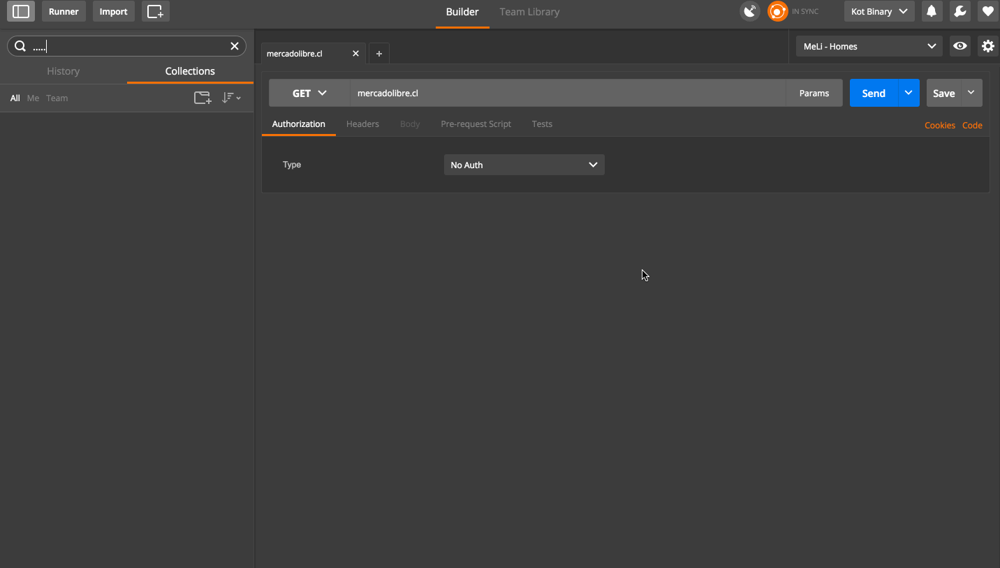
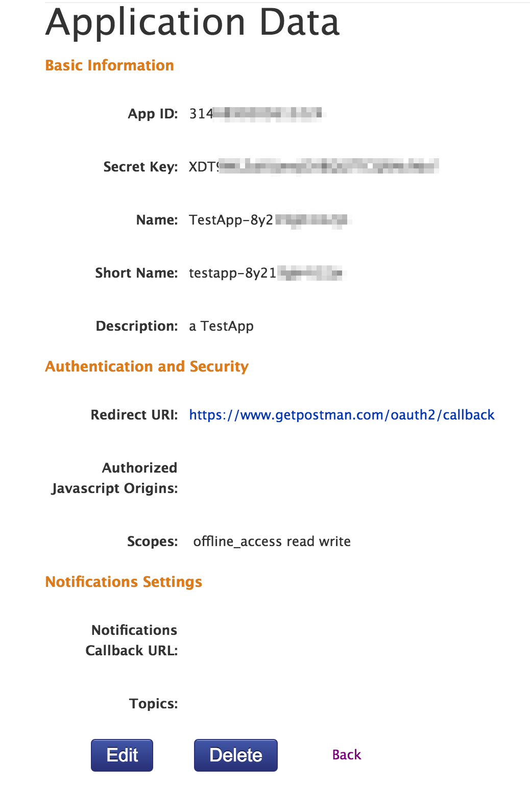
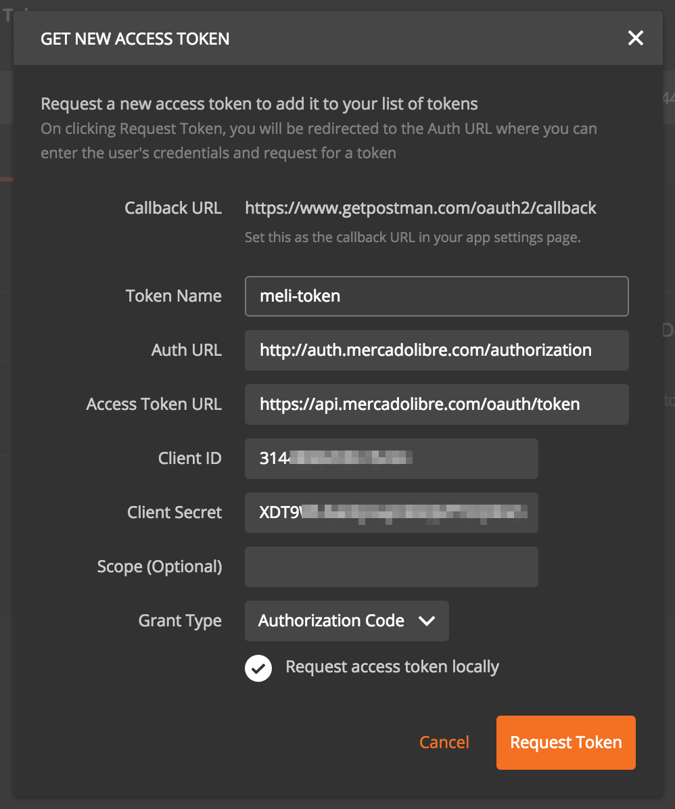

# Documentation

- Root  
	[http://developers.mercadolibre.com/es](http://developers.mercadolibre.com/es/)

- Como empezar
	[http://developers.mercadolibre.com/es/como-empezar/](http://developers.mercadolibre.com/es/como-empezar/)

- Auth
	[http://developers.mercadolibre.com/es/producto-autorizacion/](http://developers.mercadolibre.com/es/producto-autorizacion/)

	- Server side
	[http://developers.mercadolibre.com/es/autorizacion-server-side/](http://developers.mercadolibre.com/es/autorizacion-server-side/)

	- Client side
	[http://developers.mercadolibre.com/es/autorizacion-client-side/](http://developers.mercadolibre.com/es/autorizacion-client-side/)

# Postman

Download from [https://www.getpostman.com](https://www.getpostman.com)

# Logout in Postman

1. Make `GET` request to [https://mercadolibre.cl](https://mercadolibre.cl)
2. Select `Preview` 
3. and `Logout`



# App Settings

- Manage apps
	[https://applications.mercadolibre.cl/](https://applications.mercadolibre.cl/)

```
App ID:1234567890123456

Secret Key:SECRETKEYSECRETKEYSECRETKEYSECRE

Name:MyAppName

Short Name:my-app-name

Description:a TestApp

Redirect URI:https://www.getpostman.com/oauth2/callback

Authorized Javascript Origins:

Scopes: write offline_access read
```



# OAuth 2.0 Settings for Postman

| Key | Value |
|:----|:------|
| Callback URL | https://www.getpostman.com/oauth2/callback |
| Token Name | TOKEN_NAME |
| Auth URL | http://auth.mercadolibre.com/authorization |
| Access Token URL | https://api.mercadolibre.com/oauth/token |
| Client ID | 1234567890123456 |
| Client Secret | SECRETKEYSECRETKEYSECRETKEYSECRE |
| Scope (Optional) | |
| Grant Type | Authorization Code |



# Postman Collections

- Only Auth  
	[MELI\_Auth.postman\_collection.json](./MELI_Auth.postman_collection.json)

- All endpoints for workshop  
	[MELI\_Auth.postman\_collection.json](./MELI_Auth.postman_collection.json)
